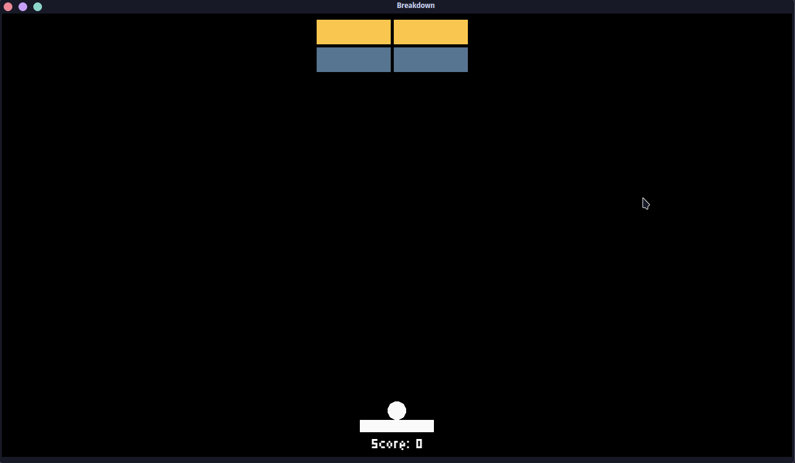

# Breakdown
A breakout game but the bricks descend.

First prototype of an SFML game made with [SFML 3 Game Template](https://www.github.com/nantr0nic/sfml3-game-template/).

**Work in progress!**

Classic breakdown game but with a descending mechanic. **Fully configurable**: the level design, brick properties (value, health, color), paddle/ball, and descent speed are all configurable in a set of TOML files. Now with cool sounds!

## Complete features
* Collision System
* Game state transitions
* Scoring system
* Data loaded from easy to read TOML files and can be modified
* Using ECS system to construct game and UI entities

## Keymap
* Shoot the ball with the ``spacebar``.
* Move the paddle with ``A`` and ``D``.
* Turn music on/off with ``M``.
* Terminate the game with ``Escape``.

## Next features
* A settings menu.
* [[maybe]] Powerups

## Config files
* ``Ball.toml`` Set ball properties and color.
* ``Player.toml`` Set paddle properties and color.
* ``Bricks.toml`` Set brick score values, health, and colors. This includes the built-in Normal, Strong, and Gold bricks and also Custom_1 and Custom_2 for custom bricks.
* ``Levels.toml`` Used to generate the levels in the game. Used to determine brick size and type per level. Code key for brick types is in the file. Can modify total number of levels (doesn't have to be the default 4).

## Build & Dependencies

The project is built using CMake with a single `CMakeLists.txt` in the root directory. Currently relies on the following libraries:

*   [**SFML 3.0.2**](https://github.com/SFML/SFML): Used for graphics, windowing, and audio.
*   [**EnTT**](https://github.com/skypjack/entt): For the ECS architecture.
*   [**toml++**](https://github.com/marzer/tomlplusplus): For parsing TOML configuration files.
